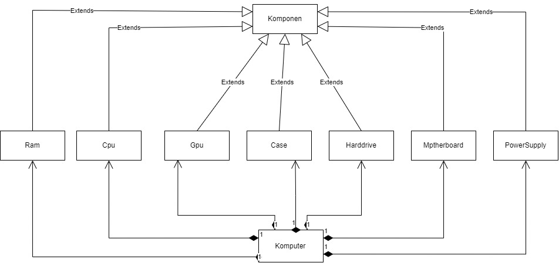
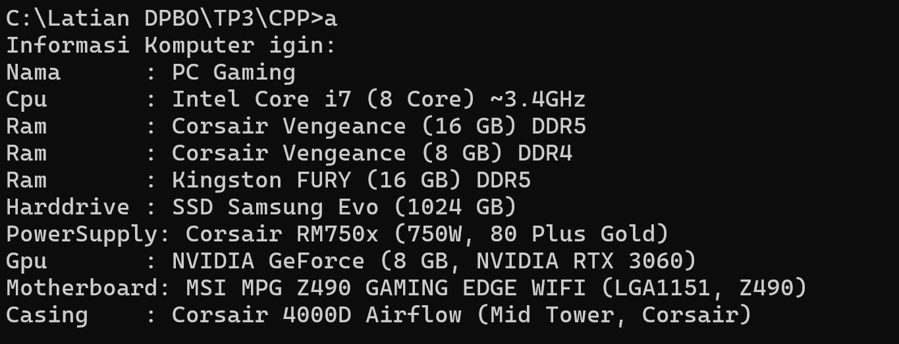
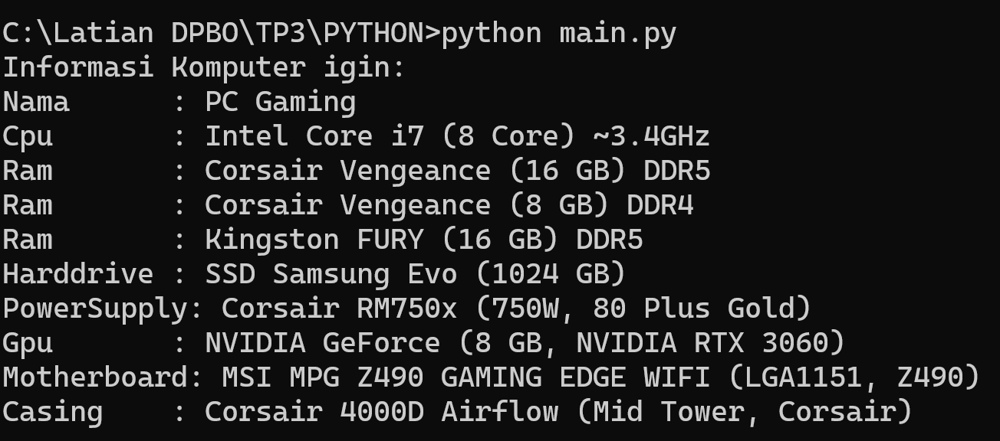

# TP3DPBO2025C2

# Janji
Saya Muhammad Igin Adigholib dengan NIM 2301125 mengerjakan Tugas Praktikum 3 dalam mata kuliah Desain dan Pemrograman Berorientasi Objek untuk keberkahanNya maka saya tidak melakukan kecurangan seperti yang telah dispesifikasikan. Aamiin.

# Alur Program
Program ini menggambarkan sebuah sistem komputer dengan berbagai komponen seperti CPU, RAM, Harddrive, dan lainnya. Komponen adalah kelas dasar, dan kelas seperti Cpu, Ram, Harddrive, Gpu, PowerSupply, Motherboard, dan Case itu "is a" turunan dari Komponen. Artinya, setiap komponen tersebut mewarisi sifat dari Komponen. Sedangkan Komputer itu "has a" berbagai komponen ini, jadi Komputer punya Cpu, Ram, Harddrive, dan lain-lain. Program ini untuk mendeskripsikan dan mengelola berbagai bagian yang ada dalam sebuah komputer.

# Design 

Desain ini menunjukkan hubungan antara kelas Komponen dengan kelas-kelas lainnya. Kelas Komponen adalah superclass yang di-extend oleh kelas-kelas seperti Ram, Cpu, Gpu, Case, Harddrive, Motherboard, dan PowerSupply. Artinya, setiap komponen tersebut mewarisi sifat dan metode dari Komponen. Kemudian, kelas Komputer memiliki hubungan has a dengan kelas-kelas ini, yang berarti Komputer terdiri dari berbagai komponen seperti CPU, RAM, Harddrive, dan lain-lain. Diagram ini menggambarkan bagaimana objek Komputer menyusun berbagai komponen untuk membentuk sebuah sistem komputer.

# Dokumentasi CPP

# Dokumentasi Python

